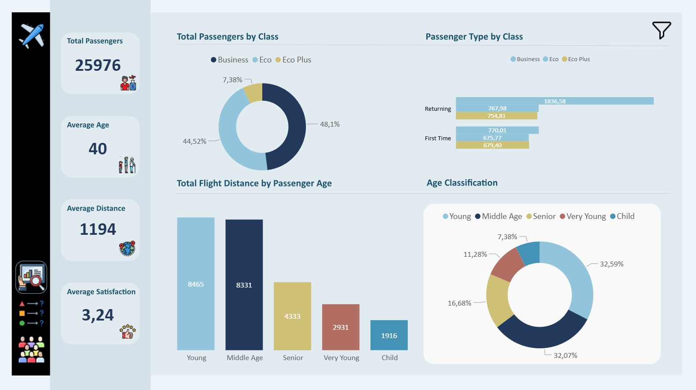
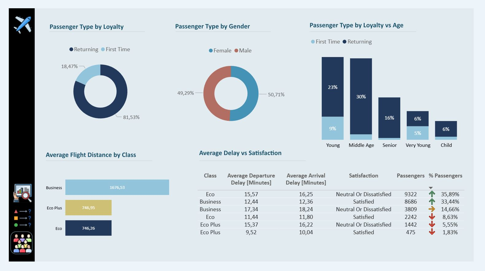
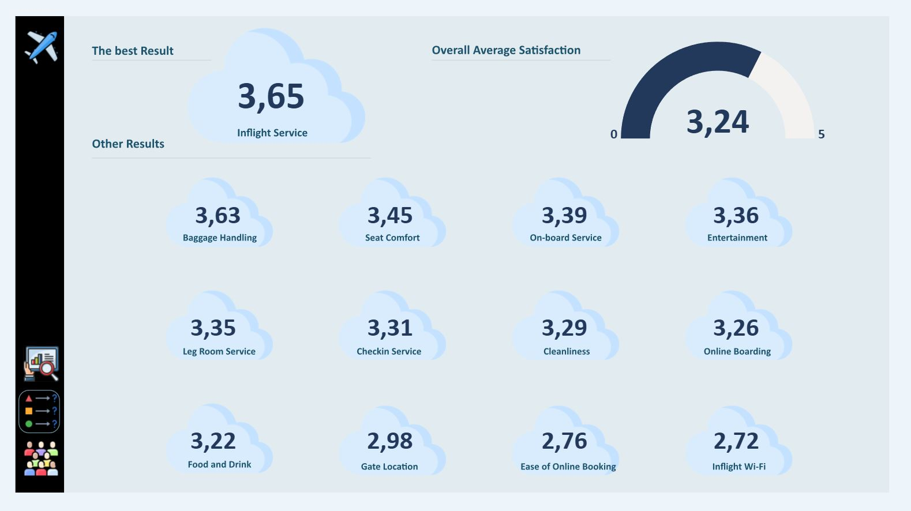

# Airlines Analysis - Power BI

## 🔗 Live Dashboard
[View the dashboard in Power BI Service](https://app.powerbi.com/view?r=eyJrIjoiOWFjNjI0YzMtZTc4ZC00NDE1LTg3OGItNDBmYmJhNGY4MTIzIiwidCI6IjNkZmU5YWI2LTgxYmYtNDkxYy1iNjcwLTAxYzgyNGEwOWUxOSJ9)

## 📸 Dashboard Preview

## 🎯 Project Objective
The objective of this project was to create an interactive Power BI dashboard to analyze passenger satisfaction levels divided by gender, loyalty or age.

## 📊 Scope of Analysis
- Key Performance Indicators [KPIs]
- Passenger Clasification
- Analysis the impact of delays and flight distance on satisfaction  
- Results overview

## 🗂 Data Source
- Public dataset from Kaggle [CSV / Excel]
- Data cleaned and transformed using Power Query

## 🔍 Analytical Approach
- Exploratory data analysis to identify the best and the worst results
- Creation of calculated measures using DAX
- Interactive visualizations for self-service analysis

## 🛠 Tools & Technologies
- Power BI
- DAX [CALCULATE, FILTER]
- Power Query
- Excel / CSV

## 📈 Key Insights
- Improved visibility of KPIs in a single dashboard
- Identification of areas requiring improvement
- Clear overview of passenger satisfaction patterns

## 📁 Repository Content
- Power BI `.pbix` file
- Dashboard screenshots

## 👤 Author
Patrycja Kaczmarek
